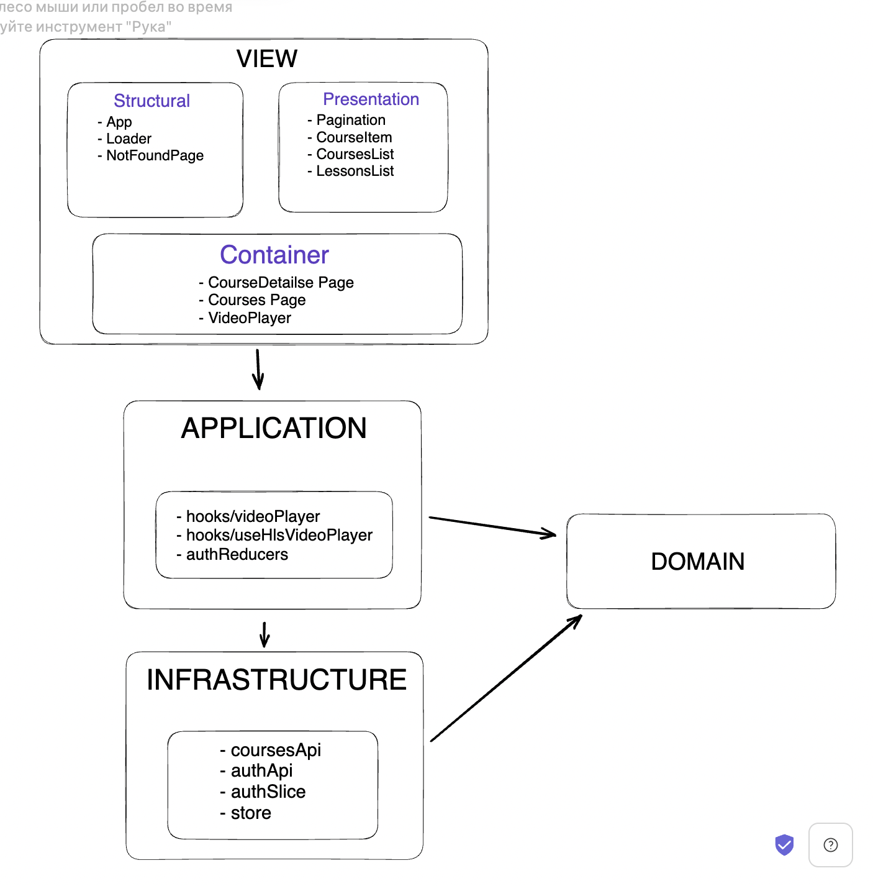

### In my project, the files are divided into the following layers:

- View,
- Infrastructure
- Application.

#### View components are divided into:

- presentation, they accept data and return events, do not have access to the store and do not call APIs (Pagination, CourseItem, CoursesList, LessonsList).
- structural are responsible for the structure, do not receive anything and do not know about Api and store (App, Loader, NotFoundPage).
- container communicates with Application, Api and store.

#### The Application layer

Knows about Infrastructure, these are custom hooks (videoPlayer, useHlsVideoPlayer, authReducers).

#### The Infrastructure layer.

Is responsible for requests to the server and saving data, it is redax, api and store.

### Layers schema

